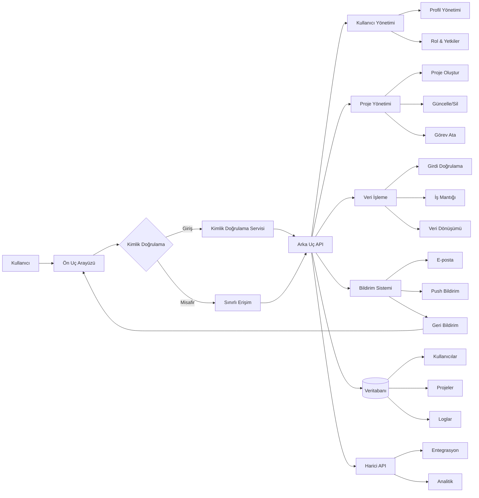

#  SGSA — Akıllı Şebeke Stres Analiz Sistemi

  <b>Gerçek zamanlı şebeke simülasyonu • Risk analizi • Modern dashboard</b>

##  İçindekiler

- Proje Hakkında  
- Özellikler  
- Kullanıcı Rolleri  
- Ekranlar  
- Teknolojiler  
- Kurulum  
- Kullanım  
- Simülasyon Mantığı  
- Veri Yapısı  
- Güvenlik Notları  
- Gelecek Geliştirmeler  
- Lisans  

---

##  Proje Hakkında

**SGSA (Smart Grid Stress Analyzer)**, modern elektrik şebekelerinde oluşabilecek yük dengesizliklerini, sistem stresini ve olası çökme risklerini analiz etmek amacıyla geliştirilmiş, tamamen tarayıcı üzerinde çalışan bir simülasyon ve görselleştirme platformudur.

Günümüz enerji altyapıları, artan tüketim, yenilenebilir enerji entegrasyonu ve dağıtık üretim gibi faktörler nedeniyle giderek daha karmaşık hale gelmektedir. Bu karmaşıklık, sistem üzerinde anlık yük dalgalanmaları ve kritik stres durumları oluşturabilir. SGSA, bu tür durumları **basitleştirilmiş ancak gerçekçi bir model ile simüle ederek** kullanıcıya anlaşılır ve etkileşimli bir analiz ortamı sunar.

###  Projenin Temel Amaçları

- Şebeke davranışını gerçek zamanlı olarak modellemek  
- Kritik yük noktalarını (node) tespit etmek  
- Sistem genelinde stres seviyesini ölçmek  
- Olası çökme (failure) senaryolarını öngörmek  
- Kullanıcıya görsel ve sezgisel bir kontrol paneli sağlamak  

---

###  Nasıl Çalışır?

SGSA, arka planda çalışan bir **simülasyon motoru** ile sistem davranışını üretir:

- Her düğüm (node), belirli bir yük değeri (%0–100) taşır  
- Bu değerler zamanla rastgele ancak kontrollü şekilde değişir  
- Tüm düğümlerin ortalaması alınarak sistem yükü hesaplanır  
- Kritik eşiklerin aşılması durumunda alarm mekanizması tetiklenir  
- Risk skoru; yük, dengesizlik ve kritik node sayısına göre belirlenir  

Bu süreç yaklaşık **her 1.2 saniyede bir güncellenir** ve kullanıcı arayüzüne anlık olarak yansıtılır.

---

###  Simülasyonun Kapsamı

SGSA aşağıdaki bileşenleri simüle eder:

-  Üretim noktaları (generation nodes)  
-  Tüketim noktaları (load nodes)  
-  Trafo merkezleri (substations)  
-  Yenilenebilir enerji kaynakları  
-  Yedek sistemler  

Bu yapı sayesinde sistem, gerçek bir elektrik şebekesinin sadeleştirilmiş bir dijital ikizi (digital twin) gibi davranır.

---

###  Mimari Yaklaşım

Proje, **frontend-only mimari** kullanır:

- Tüm iş mantığı JavaScript ile çalışır  
- Veri kalıcılığı `localStorage` üzerinden sağlanır  
- Grafikler düşük maliyetli **Canvas API** ile çizilir  
- Harici kütüphane veya framework kullanılmaz  

Bu yaklaşım sayesinde proje:

- Hafif  
- Hızlı  
- Kolay taşınabilir  
- Kurulumsuz  

bir yapı sunar.

---

###  Kimler İçin?

Bu proje özellikle:

-  Enerji sistemleri ile ilgilenenler  
-  Dashboard ve veri görselleştirme geliştirenler  
-  Simülasyon mantığını öğrenmek isteyenler  
-  Frontend geliştiriciler  

için güçlü bir referans ve demo niteliğindedir.

---

###  Önemli Not

SGSA, gerçek dünya sistemlerini birebir temsil etmez. Kullanılan model:

- Basitleştirilmiş  
- Deterministik olmayan (random etkiler içerir)  
- Eğitim ve demo amaçlıdır  

Gerçek enerji altyapılarında kullanılmadan önce ciddi mühendislik, veri entegrasyonu ve güvenlik katmanları gereklidir.

##  Özellikler

###  Kimlik Doğrulama
- Giriş / kayıt sistemi
- Rol bazlı erişim kontrolü
- localStorage ile oturum yönetimi

###  Dashboard
- Canlı veri simülasyonu
- Şebeke yükü, voltaj ve frekans takibi
- Dinamik risk göstergesi

###  Gelişmiş Görselleştirme
- Zaman serisi grafikleri (Canvas)
- Tahmin modeli grafiği
- Histogram analizleri
- Frekans & voltaj dağılımı

###  Şebeke Topolojisi
- Node tabanlı ağ yapısı
- Edge bağlantıları
- Yük yoğunluğuna göre renk kodlama

###  Alarm Sistemi
- Kritik düğüm tespiti
- Gerçek zamanlı alarm sayacı
- Event log (olay geçmişi)

###  Kontrol Paneli
- Yük simülasyonu kontrolü
- Voltaj parametreleri
- Simülasyon hız ayarı
- Alarm eşikleri
- Kullanıcı yönetimi (Admin)

---

##  Kullanıcı Rolleri

| Rol        | Açıklama |
|------------|----------|
|  İzleyici | Sadece veri görüntüleme |
|  Analist | Analiz ekranlarına erişim |
|  Mühendis | Sistem parametrelerini kısmen değiştirme |
|  Admin | Tam kontrol + kullanıcı yönetimi |

---

##  Sistem Ekranları

###  Giriş / Kayıt
- Kullanıcı oluşturma
- Rol seçimi
- Basit doğrulama sistemi

###  Genel Bakış
- Anlık metrikler
- Risk göstergesi
- Olay günlüğü

###  Topoloji
- Şebeke haritası
- Düğüm bağlantıları
- Dinamik stres renkleri

###  Analiz
- Histogram
- Risk faktörleri matrisi
- Dağılım grafikleri

###  Kontrol Paneli
- Simülasyon parametreleri
- Admin kullanıcı yönetimi

###  Alarmlar
- Kritik düğümler
- Uyarı seviyeleri
- Olay geçmişi

---

##  Kullanılan Teknolojiler

| Teknoloji | Amaç |
|----------|------|
| HTML5 | Yapı |
| CSS3 | UI / Dark Theme |
| JavaScript (Vanilla) | İş mantığı |
| Canvas API | Grafik çizimi |
| localStorage | Veri saklama |

---
##  Test Senaryoları

Aşağıdaki senaryolar ile sistemi test edebilirsiniz:

### 1. Yük Stresi Testi
- Kontrol panelinden yükü %130+ seviyesine çıkarın
- Kritik node sayısının arttığını gözlemleyin
- Alarm panelini kontrol edin

### 2. Voltaj Sapma Testi (Admin)
- Voltaj katsayısını düşürün veya artırın
- Risk skorunun nasıl değiştiğini inceleyin

### 3. Simülasyon Hız Testi
- Simülasyon hızını artırın
- Grafiklerin gerçek zamanlı güncellenmesini gözlemleyin

---

##  Kurulum

Herhangi bir bağımlılık gerektirmez.

## Sistem Diyagramı

